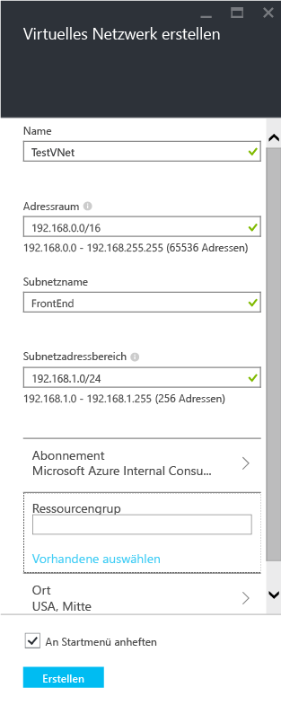
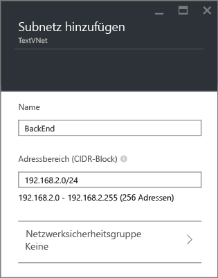
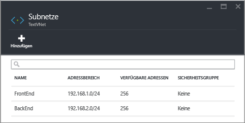

## Erstellen eines VNet im Azure-Portal.

Gehen Sie folgendermaßen vor, um mit dem Azure-Vorschauportal ein VNet basierend auf dem oben beschriebenen Szenario zu erstellen.

1. Navigieren Sie in einem Browser zu http://portal.azure.com, und melden Sie sich, falls erforderlich, mit Ihrem Azure-Konto an.
2. Klicken Sie auf **NEU** > **Netzwerk** > **Virtuelles Netzwerk**, wählen Sie in der Liste **Bereitstellungsmodell auswählen** die Option **Ressourcen-Manager** aus, und klicken Sie anschließend auf **Erstellen**, wie in der folgenden Abbildung dargestellt.

	

3. Konfigurieren Sie auf dem Blatt **Virtuelles Netzwerk erstellen** die VNet-Einstellungen, wie in der folgenden Abbildung dargestellt.

	

4. Klicken Sie auf **Ressourcengruppe**, und wählen Sie eine Ressourcengruppe aus, zu der Sie das VNet hinzufügen möchten, oder klicken Sie auf **Neu erstellen**, um das VNet zu einer neuen Ressourcengruppe hinzuzufügen. Die folgende Abbildung zeigt die Ressourcengruppeneinstellungen für eine neue Ressourcengruppe mit dem Namen **TestRG**. Weitere Informationen zu Ressourcengruppen finden Sie unter [Übersicht über den Azure-Ressourcen-Manager](../articles/resource-group-overview.md/#resource-groups).

	

5. Ändern Sie ggf. die **Abonnement**- und **Speicherort**-Einstellungen für das VNet.

6. Wenn das VNet nicht als Kachel im **Startmenü** angezeigt werden soll, deaktivieren Sie **An Startmenü anheften**.

7. Klicken Sie auf **Erstellen** und achten Sie auf die Kachel namens **Virtuelles Netzwerk erstellen**, wie in der folgenden Abbildung dargestellt.

	

8. Warten Sie, bis das VNet erstellt wurde, und klicken Sie dann auf dem Blatt **Virtuelles Netzwerk** auf **Alle Einstellungen** > **Subnetze** > **Hinzufügen**, wie nachfolgend dargestellt.

	

9. Geben Sie die Subnetzeinstellungen für das Subnetz *BackEnd* ein, wie unten dargestellt, und klicken Sie dann auf **OK**.

	

10. Eine Liste der Subnetze wird angezeigt, wie in der folgenden Abbildung dargestellt.

	

<!---HONumber=AcomDC_0323_2016-->