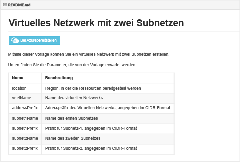
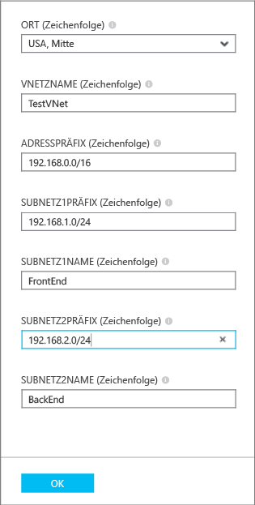
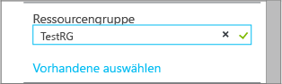

## Bereitstellen der ARM-Vorlage per Klick

Sie können vordefinierte ARM-Vorlagen, die in ein von Microsoft verwaltetes und für die Community freigegebenes GitHub-Repository hochgeladen wurden, wiederverwenden. Diese Vorlagen können direkt aus GitHub heraus bereitgestellt oder heruntergeladen und an Ihre Bedürfnisse angepasst werden. Zum Bereitstellen einer Vorlage, die ein VNet mit zwei Subnetzen erstellt, führen Sie die unten aufgeführten Schritte aus.

1. Navigieren Sie in einem Browser zu [https://github.com/Azure/azure-quickstart-templates](https://github.com/Azure/azure-quickstart-templates).
2. Führen Sie in der Liste der Vorlagen einen Bildlauf nach unten aus, und klicken Sie auf **101-vnet-two-subnets**. Überprüfen Sie die Datei **Readme.MD**, wie unten dargestellt.

	

3. Klicken Sie auf Schaltfläche zum **Bereitstellen in Azure**. Falls erforderlich, geben Sie Ihre Anmeldeinformationen für Azure ein.
4. Geben Sie auf dem Blatt **Parameter** die Werte ein, die Sie zum Erstellen Ihres neuen VNet verwenden möchten, und klicken Sie dann auf **OK**. Die folgende Abbildung zeigt die Werte für das vorliegende Szenario.

	

4. Klicken Sie auf **Ressourcengruppe**, und wählen Sie eine Ressourcengruppe aus, zu der Sie das VNet hinzufügen möchten, oder klicken Sie auf **Neu erstellen**, um das VNet zu einer neuen Ressourcengruppe hinzuzufügen. Weitere Informationen zu Ressourcengruppen finden Sie unter . Die folgende Abbildung zeigt die Ressourcengruppeneinstellungen für eine neue Ressourcengruppe mit dem Namen **TestRG**.

	

5. Ändern Sie ggf. die **Abonnement**- und **Speicherort**-Einstellungen für das VNet.
6. Wenn das VNet nicht als Kachel im **Startmenü** angezeigt werden soll, deaktivieren Sie **An Startmenü anheften**.
5. Klicken Sie auf **Rechtliche Bedingungen**, lesen Sie die Bedingungen, und klicken Sie auf **Kaufen**, wenn Sie diesen zustimmen. 
6. Klicken Sie auf **Erstellen**, um das VNet zu erstellen.

	

7. Nachdem die Bereitstellung abgeschlossen ist, klicken Sie auf **TestVNet** > **Alle Einstellungen** > **Subnetze**, um die Subnetzeigenschaften anzuzeigen, wie unten dargestellt.

	

<!---HONumber=AcomDC_0211_2016-->